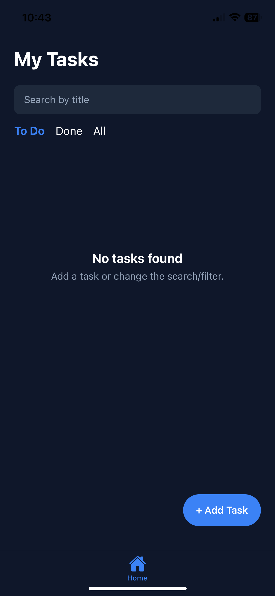
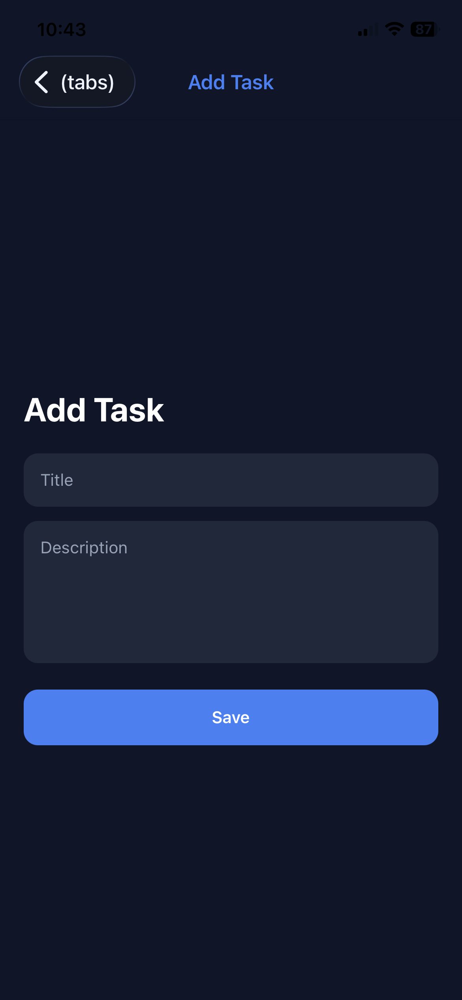
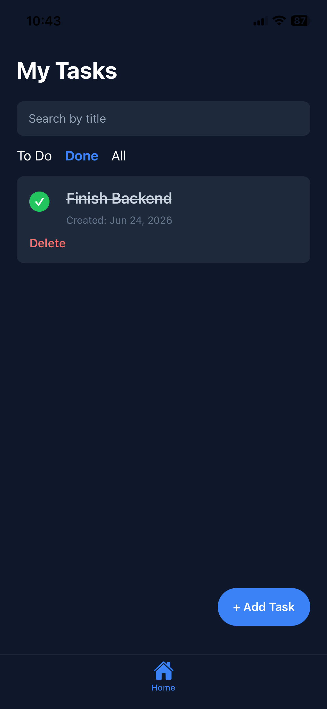
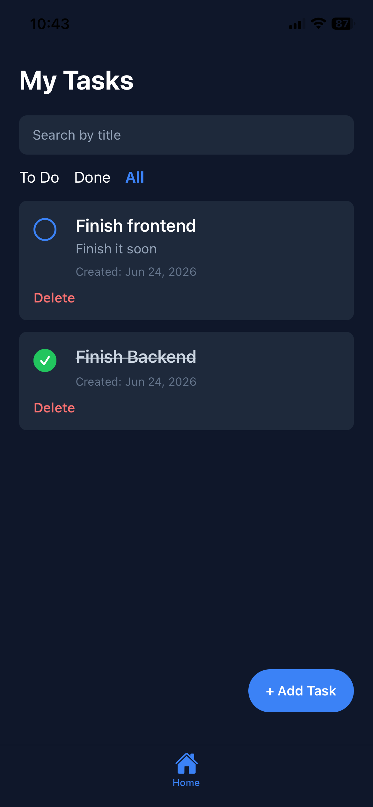

# Simple Todo App

A simple full-stack Todo app built with React Native, Node.js/Express, and MongoDB.

## Description

This app allows users to manage a small list of personal tasks. Users can add a task with a title and description, mark it as completed or not completed, delete it, search tasks by title, filter tasks by status, and open a simple details screen for each task.

The app also fetches a daily advice message from a public API and displays it on the task list screen.

## Tech Stack

- React Native with Expo
- TypeScript
- Node.js
- Express.js
- MongoDB
- Mongoose

## Features

- Add tasks
- View tasks
- Mark tasks as Done / To Do
- Delete tasks
- Search tasks by title
- Filter tasks by status: To Do, Done, All
- Simple task details screen
- Fetch a daily advice from a public API
- Empty state when there are no tasks
- Created date for each task

## Task Fields

Each task has:

- `title`: task title entered by the user
- `description`: short task description entered by the user
- `status`: completed or not completed
- `completed`: boolean value used for task completion
- `createdAt`: date when the task was created
- `updatedAt`: date when the task was last updated

## What Was Implemented

- Task list screen
- Add task screen
- Task details screen
- Mark task as completed / not completed
- Delete task
- Basic input validation
- Empty state
- Search by title
- Filter by status
- Public API fetch using Advice Slip API
- Simple navigation between screens
- MongoDB database storage through a Node.js/Express backend

## Project Structure

```text
backend/
  index.js
  models/Task.js
  routes/TaskRoutes.js

frontend/
  app/(tabs)/index.tsx
  app/add-task.tsx
  app/task/[id].tsx
  components/TaskCard.tsx
  config/api.ts
```

## API Endpoints

```http
GET /tasks
POST /tasks
GET /tasks/:id
PATCH /tasks/:id
PATCH /tasks/:id/toggle
DELETE /tasks/:id
```

## Setup

### Backend

```bash
cd backend
npm install
npm start
```

Create `backend/.env`:

```env
MONGODB_URI=your_mongodb_connection_string
PORT=5000
```

### Frontend

```bash
cd frontend
npm install
npx expo start
```

Set the API URL in `frontend/config/api.ts`:

```ts
export const API_URL = "http://YOUR_LOCAL_IP:5000";
```

## Screenshots

<p align="center">
  
  
  
  
</p>


